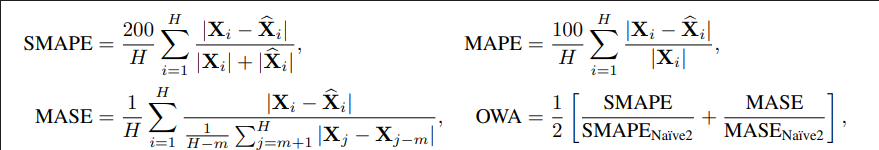

# TSGym

## Design Dimensions
### Series Normalization
- None
- Statistic
- RevIN

### Series Decomposition
- None
- Seasonal + Trend

### Series Patching 
- Use or not

### Input Encoding
- Linear projection (non-Transformer based)
- Linear projection + Positional Encoding (Transformer based)
- Series Patching (only for long-term forecasting task)

### Network Architecture

## Attention
- Self-attention
- Auto-Correlation
- Sparse Attention
- Frequency Enhanced Attention

## todo
- 20241211: TransformerGym_None_series-patching_sparse-attention, loss全是0? (nan)

## Experiment Results

OWA:
|                              |   Yearly |   Quarterly |   Monthly |   Others |   Average |   time_Hourly |   time_Daily |   time_Weekly |   time_Monthly |   time_Quarterly |   time_Yearly |
|:-----------------------------|---------:|------------:|----------:|---------:|----------:|--------------:|-------------:|--------------:|---------------:|-----------------:|--------------:|
| m4_TimesNet                  |    0.785 |       0.885 |     0.883 |    1.052 |     0.852 |      10.7905  |     82.8676  |      11.2696  |       1338.95  |         435.905  |      403.722  |
| m4_TimeMixer                 |    0.783 |       0.9   |     0.883 |    1.063 |     0.855 |       1.85885 |      7.12232 |       1.75438 |        116.586 |          37.8231 |       46.6739 |
| m4_LightTS                   |    0.8   |       0.903 |     0.885 |    1.128 |     0.865 |       6.84284 |     67.8628  |      12.1428  |        791.176 |         409.538  |      370.537  |
| m4_Mamba                     |    0.796 |       0.915 |     0.932 |    1.08  |     0.881 |      11.9123  |     76.9918  |      12.4055  |        804.05  |         398.373  |      383.377  |
| m4_DLinear                   |    0.833 |       0.929 |     0.938 |    1.115 |     0.901 |      11.7835  |     74.6968  |      17.2568  |        799.049 |         368.002  |      361.493  |
| m4_FiLM                      |    0.818 |       0.965 |     0.944 |    1.122 |     0.903 |      21.946   |    108.362   |      12.7958  |       1465.14  |         549.476  |      571.667  |
| m4_FEDformer                 |    0.824 |       0.938 |     0.996 |    1.044 |     0.918 |      34.748   |    171.532   |      17.012   |       3400.5   |         736.557  |      550.187  |
| m4_iTransformer              |    0.846 |       0.956 |     1.013 |    1.222 |     0.944 |      12.5103  |    107.544   |      21.2947  |       1070.96  |         475.472  |      525.327  |
| m4_Reformer                  |    0.853 |       0.969 |     0.984 |    1.421 |     0.945 |       9.46962 |     52.1175  |       7.09545 |       1282.79  |         271.15   |      423.466  |
| m4_MICN                      |    0.867 |       1.025 |     0.986 |    1.321 |     0.96  |      15.8946  |     91.3375  |      14.1646  |        891.077 |         455.115  |      419.68   |
| m4_Pyraformer                |    0.851 |       1.038 |     1.148 |    1.199 |     1.009 |       6.24687 |     55.8523  |       8.74816 |       1485.65  |         448.422  |      575.105  |
| m4_Informer                  |    0.879 |       1.146 |     1.118 |    1.437 |     1.039 |       6.15542 |     37.2721  |       5.42212 |       3627.39  |         417.751  |      980.814  |
| m4_Autoformer                |    1.045 |       1.321 |     1.359 |    1.444 |     1.221 |      24.3088  |    180.987   |      25.0783  |       4009.86  |         927.371  |      693.116  |
| m4_Transformer               |    4.414 |       8.192 |     7.669 |   24.104 |     7.073 |       7.51686 |     58.4034  |       7.73109 |       1371.29  |         313.17   |      480.531  |
| m4_Crossformer               |    4.777 |       8.178 |     7.691 |   36.934 |     7.765 |      16.0566  |    136.653   |      14.7705  |       1536.25  |         669.199  |      817.968  |
| m4_Nonstationary_Transformer |  nan     |       1.114 |     1.122 |  nan     |   nan     |       7.68704 |     58.7085  |       7.35334 |       1505.45  |         332.41   |      423.319  |

|                                                                                        |   Yearly |   Quarterly |   Monthly |   Others |   Average |   time_Hourly |   time_Daily |   time_Weekly |   time_Monthly |   time_Quarterly |   time_Yearly |
|:---------------------------------------------------------------------------------------|---------:|------------:|----------:|---------:|----------:|--------------:|-------------:|--------------:|---------------:|-----------------:|--------------:|
| m4_TSGym_Stat_False_positional-encoding_Transformer_auto-correlation_True              |    0.809 |       0.89  |     0.902 |    1.057 |     0.869 |       9.00144 |      72.7216 |       8.36369 |       2499.04  |          463.646 |       587.087 |
| m4_TSGym_RevIN_False_positional-encoding_Transformer_auto-correlation_True             |    0.825 |       0.891 |     0.898 |    1.075 |     0.875 |      12.8589  |      98.3221 |      10.333   |        835.854 |          352.122 |       287.467 |
| m4_TSGym_Stat_True_positional-encoding_Transformer_auto-correlation_True               |    0.819 |       0.893 |     0.909 |    1.04  |     0.877 |       8.77885 |      80.3002 |      10.5954  |       1480.36  |          623.807 |       625.769 |
| m4_TSGym_RevIN_True_positional-encoding_Transformer_auto-correlation_True              |    0.809 |       0.909 |     0.92  |    1.031 |     0.878 |       5.47885 |      42.0313 |       5.06657 |       1051.34  |          214.298 |       238.105 |
| m4_TSGym_Stat_True_positional-encoding_GRU_null_True                                   |    0.794 |       0.921 |     0.943 |    1.013 |     0.882 |      12.6021  |      86.4435 |      12.2815  |       1494.07  |          490.509 |       617.061 |
| m4_TSGym_RevIN_True_positional-encoding_GRU_null_True                                  |    0.793 |       0.922 |     0.954 |    0.987 |     0.884 |       9.38926 |      58.3855 |       9.51548 |       1054.06  |          228.229 |       242.905 |
| m4_TSGym_Stat_False_positional-encoding_GRU_null_True                                  |    0.797 |       0.93  |     0.962 |    1.03  |     0.892 |      13.9883  |      94.526  |      16.7798  |       1223.34  |          515.851 |       539.03  |
| m4_TSGym_RevIN_False_positional-encoding_GRU_null_True                                 |    0.797 |       0.933 |     0.962 |    1.031 |     0.892 |      13.2099  |      97.8416 |      17.0198  |       1235.7   |          517.882 |       544.754 |
| m4_TSGym_RevIN_True_positional-encoding_Transformer_frequency-enhanced-attention_True  |    0.81  |       0.967 |     0.988 |    1.052 |     0.914 |      22.5506  |      91.4208 |       9.08135 |       1113.81  |          336.365 |       296.244 |
| m4_TSGym_Stat_True_positional-encoding_Transformer_frequency-enhanced-attention_True   |    0.798 |       0.971 |     1.007 |    1.049 |     0.917 |      21.0861  |     101.979  |      13.8201  |       1371.3   |          512.316 |       407.822 |
| m4_TSGym_RevIN_True_positional-encoding_Transformer_self-attention_True                |    0.81  |       1.017 |     1.023 |    1.091 |     0.937 |       5.72649 |      39.9017 |       6.02953 |        527.027 |          300.746 |       290.6   |
| m4_TSGym_RevIN_True_positional-encoding_Transformer_sparse-attention_True              |    0.831 |       1.008 |     1.022 |    1.067 |     0.943 |       3.90073 |      26.1614 |       3.98718 |        843.188 |          160.607 |       165.188 |
| m4_TSGym_Stat_True_positional-encoding_Transformer_sparse-attention_True               |    0.828 |       1.024 |     1.024 |    1.062 |     0.945 |       4.58395 |      34.3451 |       4.16363 |       1557.49  |          209.694 |       656.331 |
| m4_TSGym_Stat_True_positional-encoding_MLP_null_True                                   |    0.8   |       1.034 |     1.082 |    1.051 |     0.957 |      14.8708  |      95.9925 |      14.8865  |       1079.53  |          512.675 |       512.651 |
| m4_TSGym_RevIN_True_positional-encoding_MLP_null_True                                  |    0.798 |       1.033 |     1.087 |    1.06  |     0.958 |       8.66737 |      41.46   |       6.91389 |        954.959 |          312.541 |       344.145 |
| m4_TSGym_Stat_True_positional-encoding_Transformer_self-attention_True                 |    0.89  |       1.015 |     1.018 |    1.13  |     0.967 |       7.18517 |      63.4489 |       9.053   |        960.434 |          289.352 |       325.338 |
| m4_TSGym_RevIN_False_positional-encoding_Transformer_frequency-enhanced-attention_True |    0.89  |       1.033 |     1.03  |    1.191 |     0.98  |      14.3869  |      68.8649 |       9.58262 |        812.741 |          354.697 |       234.449 |
| m4_TSGym_Stat_False_positional-encoding_Transformer_frequency-enhanced-attention_True  |    0.872 |       1.045 |     1.059 |    1.229 |     0.987 |      14.0396  |      66.748  |       7.80811 |       1054.02  |          321.002 |       335.377 |
| m4_TSGym_RevIN_False_positional-encoding_Transformer_sparse-attention_True             |    0.866 |       1.063 |     1.12  |    1.156 |     1.005 |       4.61276 |      30.7229 |       4.25352 |        920.863 |          139.557 |       486.906 |
| m4_TSGym_Stat_False_positional-encoding_Transformer_sparse-attention_True              |    0.895 |       1.103 |     1.057 |    1.19  |     1.005 |      11.2848  |      61.5736 |       7.70034 |       1524.35  |          463.886 |       415.639 |
| m4_TSGym_None_True_positional-encoding_MLP_null_True                                   |    0.865 |       1.076 |     1.101 |    1.375 |     1.016 |      13.9395  |     101.333  |      15.9415  |       1088.39  |          511.21  |       509.52  |
| m4_TSGym_RevIN_False_positional-encoding_Transformer_self-attention_True               |    0.938 |       1.099 |     1.08  |    1.287 |     1.033 |       5.67157 |      38.5392 |       5.73889 |        434.229 |          257.828 |       197.542 |
| m4_TSGym_Stat_False_positional-encoding_Transformer_self-attention_True                |    0.907 |       1.103 |     1.148 |    1.227 |     1.042 |      10.9762  |      80.9989 |      14.1261  |       1420.07  |          521.732 |       629.452 |
| m4_TSGym_RevIN_False_positional-encoding_MLP_null_True                                 |    0.987 |       1.204 |     1.329 |    1.284 |     1.161 |      16.1345  |      92.7958 |      16.9475  |       1032.53  |          487.231 |       487.997 |
| m4_TSGym_Stat_False_positional-encoding_MLP_null_True                                  |    0.987 |       1.221 |     1.326 |    1.288 |     1.163 |      16.5649  |      85.3662 |      16.9543  |       1030.55  |          489.836 |       483.706 |
| m4_TSGym_None_False_positional-encoding_MLP_null_True                                  |    1.11  |       1.242 |     1.338 |    1.238 |     1.218 |      13.1882  |      97.7783 |      12.5972  |       1033.05  |          505.516 |       487.554 |
| m4_TSGym_None_True_positional-encoding_Transformer_auto-correlation_True               |    4.266 |       8.199 |     7.111 |   22.913 |     6.777 |      15.6249  |     120.459  |      12.7678  |       3206.96  |          618.925 |       690.768 |
| m4_TSGym_None_True_positional-encoding_Transformer_frequency-enhanced-attention_True   |    4.283 |       8.198 |     7.675 |   22.911 |     6.966 |      24.609   |     117.889  |      12.051   |       2576.45  |          752.433 |       938.892 |
| m4_TSGym_None_True_positional-encoding_Transformer_sparse-attention_True               |    4.371 |       8.191 |     7.673 |   22.909 |     7.007 |      16.6909  |     136.263  |      12.6683  |       5058.91  |          785.951 |       732.304 |
| m4_TSGym_None_True_positional-encoding_Transformer_self-attention_True                 |    4.386 |       8.198 |     7.668 |   22.933 |     7.016 |      18.043   |     143.917  |      17.7291  |       1956.93  |          881.657 |       877.338 |
| m4_TSGym_None_False_positional-encoding_Transformer_frequency-enhanced-attention_True  |    4.281 |       8.192 |     7.669 |   24.12  |     7.019 |      27.3347  |     143.354  |      18.3071  |       1760.54  |          739.793 |       725.013 |
| m4_TSGym_None_True_positional-encoding_GRU_null_True                                   |    4.522 |       8.211 |     6.84  |   28.087 |     7.042 |      11.2435  |      82.209  |       9.63266 |       1495.17  |          491.434 |       617.178 |
| m4_TSGym_None_False_positional-encoding_Transformer_auto-correlation_True              |    4.399 |       8.193 |     7.668 |   24.092 |     7.069 |      13.9461  |      82.5262 |       7.4011  |       2497.94  |          485.3   |       683.691 |
| m4_TSGym_None_False_positional-encoding_Transformer_self-attention_True                |    4.406 |       8.192 |     7.668 |   24.093 |     7.071 |      14.7355  |     106.15   |      13.4719  |       1419.2   |          657.175 |       635.367 |
| m4_TSGym_None_False_positional-encoding_Transformer_sparse-attention_True              |    4.411 |       8.191 |     7.668 |   24.104 |     7.072 |       9.54613 |      98.4046 |      11.2124  |       3204     |          564.675 |       675.978 |
| m4_TSGym_None_False_positional-encoding_GRU_null_True                                  |    5.201 |       8.666 |     7.666 |   32.772 |     7.844 |      15.047   |      90.6145 |      11.1655  |       1228.52  |          516.839 |       544.34  |
