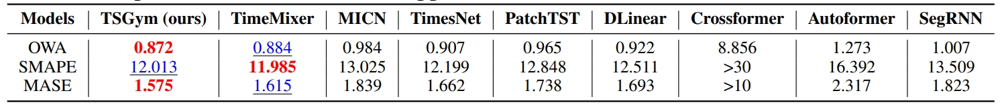

# 🤖TSGym: Design Choices for Deep Multivariate Time-Series Forecasting

TSGym is a novel automated MTSF (multivariate time series forecasting) solution, performing fine-grained component selection and automated model construction.
Based on meta-learning method, TSGym enables the creation of more effective solutions tailored to diverse time series data or forecasting task.

### Updates

<!-- 🚩2025.8: The paper revised in response to reviewer comments is publicly available on GitHub, enabling reviewers and the broader community to access the latest version at any time. -->

🚩2025.5: The code for all experiments in our paper is open-sourced on GitHub. We plan to release all code scripts and full details of the paper.

## Design Dimensions

✅TSGym decouples existing SOTA methods according to the standard **Pipeline** of MTSF modeling.\
✅TSGym significantly expands the diversity of the modeling pipeline and structures each pipeline step according to distinct **Design Dimensions** (see the following Table).\
✅TSGym automatically constructs DL-based time-series forecasting model by specified **Design Choices** via meta-learning, *achieving significantly better performance* compared to current SOTA solutions in both short-/long-term forecasting tasks.

<!-- ### Data Augmentation
- tslib

### ↓ Series Normalization
- None
- Statistic
- RevIN
- DishTS

### ↓ Series Decomposition
- None
- Moving Average
- MoE Moving Average (from FEDformer)
- DFT
- multi-resolution (like TimesNet and TimeMixer++, todo)

### ↓ Series Embedding (tokenization)
- channel-dependent
    - series-encoding (linear projection + positional-encoding for transformer-based; linear projection for non-transformer-based)
    - inverted-encoding (in iTransformer)
- channel-independent
    - series-encoding
    - series-patching
- channel-attention (todo)

### ↓ Series Mixing
- seasonal mixing (high -> low) & trend mixing (low -> high)
    - cross-attention
    - linear projection (like Timixer, todo) 

### ↓ Network Architecture
- MLP
    - TSMixer (todo)
- GRU
    - segRNN (alignment, todo)
- CNN (e.g., TimesNet)
- Transformer
    - Self-attention
    - Auto-Correlation
    - Sparse Attention
    - Frequency Enhanced Attention
    - TwostageAttention (todo)
    - Nonstationary Attention
- LLM
    - GPT4TS
    - TimeLLM
- TSFM
    - Timer
    - Moment(-base)
    
ps: w.r.t. LLM and TSFM, series-patching is the default option.

### Network Training -->
## Large Benchmarking towards Design Choices via TSGym
TSGym's ability to deconstruct deep time series models facilitates large-scale, component-level (i.e., design choice) evaluations. For detailed results, please see the full paper.

## Automated construction MTSF models via TSGym
Compared with other state-of-the-art forecasters, TSGym demonstrates superior capability in both short-term and long-term MTSF tasks.

## Python Package Requirements
- einops==0.8.0
- local-attention==1.9.14
- matplotlib==3.7.0
- numpy==1.23.5
- pandas==1.5.3
- patool==1.12
- reformer-pytorch==1.4.4
- scikit-learn==1.2.2
- scipy==1.10.1
- sktime==0.16.1
- sympy==1.11.1
- tqdm==4.64.1
